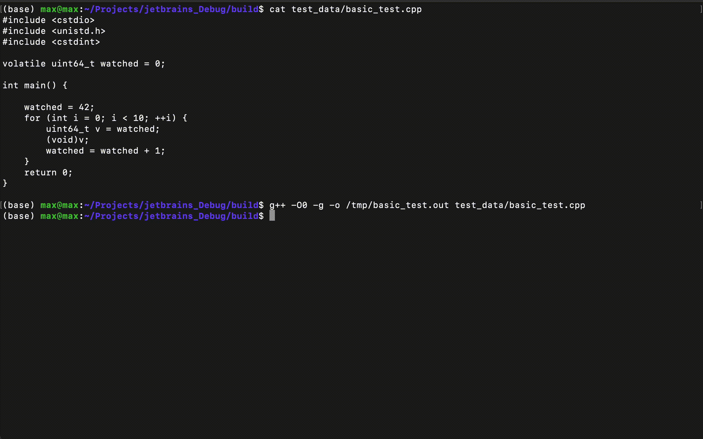

# Global Variable Watcher

Terminal-based application to watched over the variable in binary executable,
loging all writes and reads over it.



## How to use

Application, in the form of an executable binary file, accepts 2 two
arguments: variable, which we are going to observe and path to the binary.

```bash
g++ -O0 -g -o /tmp/basic_test.out test_data/basic_test.cpp
./gwatch --var watched --exec /tmp/basic_test.out
>
watched				write			0 -> 42
watched				read			42
watched				read			42
watched				write			42 -> 43
watched				read			43
watched				read			43
watched				write			43 -> 44
watched				read			44
watched				read			44
watched				write			44 -> 45
watched				read			45
watched				read			45
watched				write			45 -> 46
watched				read			46
watched				read			46
watched				write			46 -> 47
watched				read			47
watched				read			47
watched				write			47 -> 48
watched				read			48
watched				read			48
watched				write			48 -> 49
watched				read			49
watched				read			49
watched				write			49 -> 50
watched				read			50
watched				read			50
watched				write			50 -> 51
watched				read			51
watched				read			51
watched				write			51 -> 52
```

where *basic_test.cpp* is

```
#include <cstdio>
#include <unistd.h>
#include <cstdint>

volatile uint64_t watched = 0;

int main() {

    watched = 42;
    for (int i = 0; i < 10; ++i) {
        uint64_t v = watched;
        (void)v;
        watched = watched + 1;
    }
    return 0;
}
```

### Compiling

```bash
cd watcher
mdkir build
cd build
cmake ..
make
```

### Testing

Binary for testing is created together, with the project execution file.

```bash
./gwatch_test
```
